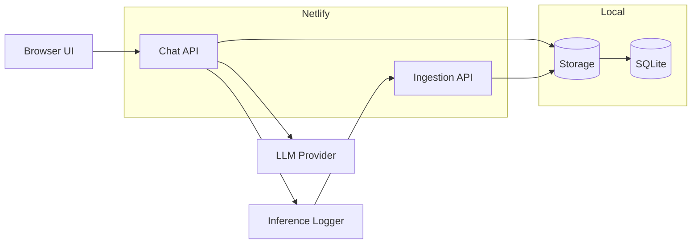

# Lightweight LLM Chatbot + Inference Logging

This project is a small full-stack Node.js app that includes:

- A multi-turn chatbot UI
- A lightweight inference wrapper that captures latency and usage metadata
- An ingestion endpoint for near-real-time log collection
- SQLite storage for local development
- Netlify Functions + external Postgres for production deployment

## Run

1. Copy [.env.local.example](/Users/asif/Desktop/Chatbot/.env.local.example) to `.env`.
2. If you want real model calls locally, set `OPENAI_API_KEY`; otherwise leave it blank and the app uses mock mode.
3. Start the app:

```bash
npm start
```

4. Open `http://localhost:3000`

## Netlify deployment

1. Create a Netlify site from this repository.
2. Provision an external Postgres database such as Neon or Supabase.
3. Apply the schema in `db/schema.sql` to that database.
4. Copy [.env.netlify.example](/Users/asif/Desktop/Chatbot/.env.netlify.example) values into the Netlify environment variables panel.
5. Deploy. The UI is served from `public/` and the API routes are rewritten to Netlify Functions via `netlify.toml`.

## Notes

- The app uses an OpenAI-compatible chat completion API by default.
- If you do not set `OPENAI_API_KEY`, you can still use the `mock` provider from the UI for local testing.
- The ingestion endpoint is `POST /ingest` and accepts structured inference log payloads from the SDK wrapper.
- The standalone Node server remains available for local development and binds to `127.0.0.1` by default.
- The Netlify build no longer depends on the managed Netlify Database feature, so it works on accounts where that feature is unavailable.
- Local development reads `.env` through `node --env-file=.env server.js`.

## Deployment Diagram



## Schema

- `conversations`: one row per session.
- `messages`: chat messages for each conversation.
- `inference_logs`: normalized request/response log records.
- `inference_metadata`: extracted metadata as key/value pairs.

See [ARCHITECTURE.md](./ARCHITECTURE.md) for the full system breakdown.
